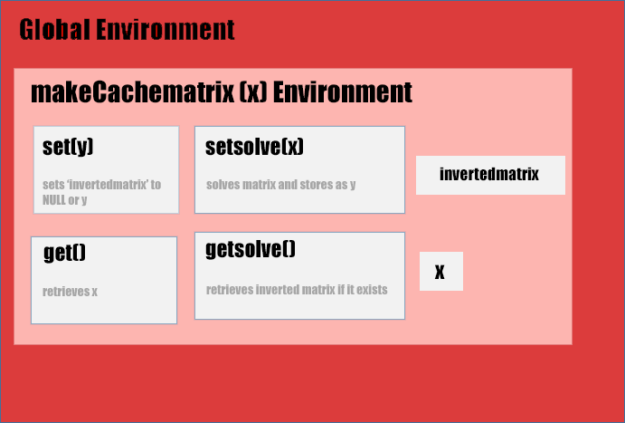

\thispagestyle{empty}
\clearpage
\pagenumbering{arabic} 
\pagebreak

```{r tinytex, include=FALSE}
## INSTALLING LATEX FOR RMARKDOWN

#RMarkdown requires LaTex to create pdf documents as an output. More information can be found [here](https://bookdown.org/yihui/rmarkdown/pdf-document.html). Alternatively, output can be set to "html_document" or "word_document". End users may install LaTex by setting the "wanttinytex" variable to FALSE and running the following script:

#Install tinytex to let RMarkdown create a pdf document? Default: wanttinytex <- FALSE
wanttinytex <- FALSE

if(wanttinytex == TRUE){

if(tinytex:::is_tinytex()==FALSE && wanttinytex == TRUE){
  if (!require("tinytex")) install.packages("tinytex")
  tinytex::install_tinytex()
  tinytex:::install_prebuilt()}

library("tinytex")
#tlmgr_install("fvextra")

}

```

```{r setup, include=FALSE}
knitr::opts_chunk$set(echo = TRUE,warning=FALSE)

if (!require("tidyverse")) install.packages("tidyverse")
library("tidyverse")

if (!require("ggplot2")) install.packages("ggplot2")
library("ggplot2")

if (!require("ggthemes")) install.packages("ggthemes")
library("ggthemes")
```

# Correspondence 
Please address any questions to Myron Keith Gibert Jr at [mkgibertjr@msn.com](mailto:mkgibertjr@msn.com).  Code for this project is stored in a [GitHub repository](https://github.com/mkgibertjr/CouseraRProgramming_Assignments).

# Introduction
For this assignment, I created two functions.  The first function will create a special list vector that can store an inverted matrix based on an input matrix.  The second function will create an inverted matrix using the special vector and store that matrix within that vector's environment.  In addition to acquiring more practice in writing functions, this assignment involved an understanding of lexical scoping. Because of this, I will take extra steps to explain what each function does, and then perform some tests at the end to confirm that the functions work as intended.

The full instructions for this assignment can be found [here](https://github.com/rdpeng/ProgrammingAssignment2).

# Part 1: Initializing a test matrix

To confirm that my functions work, I am going to use a test matrix and its solution from [MathisFun.com](https://www.mathsisfun.com/algebra/matrix-inverse.html). I will store the test input as x and the solution as n. After running x through my two functions, the solution output and n should be identical.

```{r init}
# I want to initialize x as the matrix that already has an inverted solution.
testmatrix <- matrix(c(4,2,7,6),2,2)
# I will initialize n as the matrix solution
solutionmatrix <- matrix(c(0.6,-0.2,-0.7,0.4),2,2)
```

# Part 2: Writing a function to cache a matrix
## Part A: makeCacheMatrix function

I first wrote a function named 'makeCacheMatrix' that will create a special list vector that can store the following:

* x: the original input matrix.
* invertedmatrix: the value of the inverted input matrix (x). This function will not calculate the inverse itself, and will instead set it to NULL.  It will use a subsequent function to do so.
* set: a stored function that will either set the solved matrix to NULL if it does not exist.
* get: a stored function that will retrieve the original matrix that has been stored in the function environment under the x variable.
* setsolve: a stored function that will record the solved matrix if it exists.
* getsolve: a stored function that will retrieve the solved matrix if it exists.

```{r makeCacheMatrix}
# This function will store a list containing the following:
# I use some matrix (x) as an input.  (See the above example)

makeCacheMatrix <- function(x = matrix()) {
  
# Initialize the value of the inverted matrix to null
# This will determine whether the solving function needs to perform
# any calculations
  
  invertedmatrix <- NULL
  set <- function(y) {
    x <<- y
    invertedmatrix <<- NULL
  }
  
# Get the original matrix from the parent environment
  get <- function() x
  
# Set i to the inverted solution matrix
  setsolve <- function(solve) invertedmatrix <<- solve
  
# Cache the solved matrix
  getsolve <- function() invertedmatrix
  
# Create a list containing each of the above functions in the function's environment.
# The outputs will instead be recorded, where applicable.
  
  list(set = set, get = get,
       setsolve = setsolve,
       getsolve = getsolve)
  
}

```

## Part B: the makeCachematrix Environment

This function utilizes lexical scoping and stores its variables in a sub environment.  The hierarchy of the environment is like so.  Variables and functions in higher environments can use all variables stored in sub environments, but not the inverse.

```{r graphics, echo=FALSE,fig.width=8,fig.height=5}
library(knitr)

```

makeCachematrix stores the four functions and two variables from part 2a within its environment.  After creating the environment list using this function, all subsequent functions in the global environment can make use of the makeCachematrix environment by using the list as an input.

To complete this part of the assignment, I reviewed my course materials and sought help from [https://github.com/lgreski/datasciencectacontent/blob/master/markdown/rprog-breakingDownMakeVector.md](https://github.com/lgreski/datasciencectacontent/blob/master/markdown/rprog-breakingDownMakeVector.md).

# Part 3: cacheSolve function

I then wrote a function named 'cacheSolve' that will use the solve() function to invert the input matrix x and the cache that solution using setsolve. The function will first check to see if a solution has already been cached using the getsolve function from earlier.  If the solution already exists (setsolve = y in the makeCachematrix environment), the function will not perform any calculations, will instead pull y from the cache, and notify the user that the cache is being used instead.  If invertedmatrix was set to NULL using makecachematrix, it will calculate the inverted matrix and set that as y.

```{r cacheSolve}
# Calculates the inverse of the matrix input using the last function.

cacheSolve <- function(x, ...) {
  
  
# Searches for solved matrix from "getsolve" variable output from last function
  i <- x$getsolve()

    
# If the solution was already cached, the function will not perform any calculations
# and will instead return the solved matrix  
  if(!is.null(i)) {
    message("getting cached data")
    return(i)
  }
  
# If the solution was not cached, the function will solve the matrix and then cache it.
# Get the original matrix
    data <- x$get()
    
# invert the matrix
  i <- solve(data, ...)
  
# Set i to the inverted solution matrix
  x$setsolve(i)
  
# Print the solution
  i
}
```

# Part 4: Testing the functions

I have been taught that good coding involves testing one's code and confirming that it works as intended.  I am using the test matrix x and its solution n (from Part 1) for this test.

## Test 1: Confirm that functions run without errors

I want to first confirm that these functions will run without errors.  I will test these functions on testmatrix and save them as new objects.

```{r test1}
# Confirm that functions run without errors.

mcm_testmatrix <- makeCacheMatrix(testmatrix)

cs_testmatrix <- cacheSolve(mcm_testmatrix)
```

The scripts run without errors.

## Test 2: Confirm that cacheSolve will utilize the cache

I now want to confirm that cacheSolve will not perform the same calculations on a solved and inverted matrix.  If I run cacheSolve on a matrix object that already has a solution, it should retrieve the solution from the cache instead and notify the user. I will save the output for makeCacheMatrix as cachetester for this example to prevent any conflicts with previously stored outputs of makeCacheMatrix.

```{r test2}
# Confirm that cacheSolve will utilize the cache on subsequent runs
# To do this, I must run the function twice, with the second output retrieving from the cache.
# I first run makeCacheMatrix on testmatrix to produce the input for cacheSolve, named cachetester.
cachetester <- makeCacheMatrix(testmatrix)

# This instance will solve the matrix and cache it.
cacheSolve(cachetester)

# This instance will pull the solution from the cache instead.
cacheSolve(cachetester)
```

The second instance of cacheSolve retrieves from the cache and notifies the user instead of performing the calculations again.

## Test 3: Confirm that output solution matrix is correct

My final test is to confirm that my functions produce a final output that is identical to the correct solution.  This is very important, as the entire purpose of these functions is to invert an input matrix correctly and in a memory efficient manner.  An incorrect output would defeat the purpose of writing the functions.

I first want to confirm that my final output, cs_testmatrix, is the same as the true solution, solutionmatrix, using the identical() function. Since solutionmatrix is rounded to the nearest tenth, I also round my output to the nearest tenth.

I then print both matrices to confirm visually that they are identical.  This is fine for smaller matrices, but we would rely on the identical() function for larger ones.

```{r}
## Confirm that the created inverted matrix is correct.
## I round the solution matrices to the nearest tenth, because the actual solution is rounded to the nearest tenth.
## https://www.mathsisfun.com/algebra/matrix-inverse.html
identical(round(cs_testmatrix,1),round(solutionmatrix,1))

## Print my solution vector
print(cs_testmatrix)

## Print the actual solution
print(solutionmatrix)
```

The matrices are identical, so the functions work as intended.

# Conclusion and Additional Tests

The functions do work as intended.  To confirm that the functions are more memory efficient than performing the calculations manually, a much larger test matrix would be needed.  Since this cannot be confirmed visually, I have not included this test. These functions should hypothetically be more memory efficient since they will retrieve a single object rather than performing calculations on an object.
